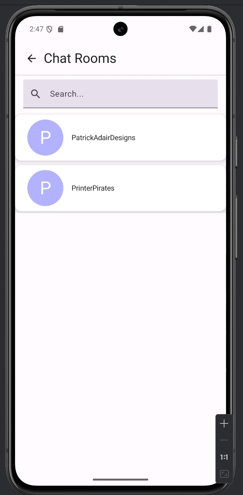
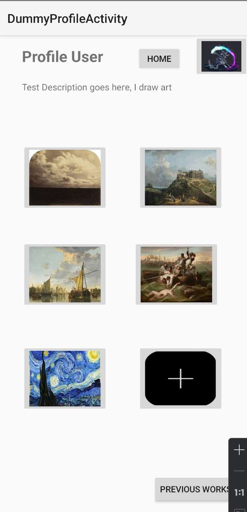
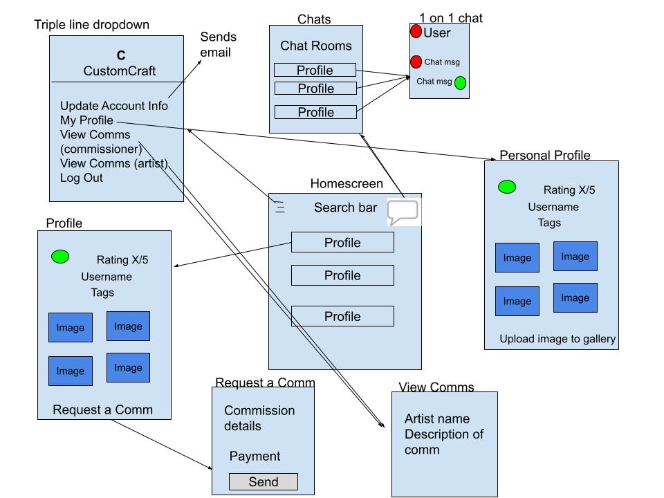

<html lang="en">
<head>
  <meta charset="utf-8" />
  <meta name="viewport" content="width=device-width,initial-scale=1" />
  <title>CustomCraft — CS Capstone 2025</title>
  <link href="https://fonts.googleapis.com/css2?family=Inter:wght@300;400;600;700;800&display=swap" rel="stylesheet">
  <link rel="stylesheet" href="style.css">
</head>
<body>
  

    <header class="hero-card">
      

        
 CS Capstone • Fall 2025

        <h1 class="title">CustomCraft</h1>
        

          An Android application that allows users to commission custom made items.
        

        

          Project Type: Android Mobile App
          Platform: Android (Kotlin, Jetpack Compose)
          Backend: Firebase (Auth, Firestore, Storage)
        

      

    </header>

    <nav class="tabbar" aria-label="Sections">
      <a href="#intro" class="tab">Introduction</a>
      <a href="#background" class="tab">Background & Motivation</a>
      <a href="#approach" class="tab">Methodology / Approach</a>
      <a href="#results" class="tab">Results & Findings</a>
      <a href="#future" class="tab">Discussion & Future Work</a>
      <a href="#feedback" class="tab">Feedback</a>
      <a href="#ack" class="tab">Acknowledgments</a>
    </nav>

    <main class="container">
      <section id="intro" class="card section">
        <h2>1. Project Title & Introduction</h2>
        
        
<strong>CustomCraft</strong> is an application made for Android that allows users to search for artists and be able to commission them for custom made items. Artists can use this app to be commissioned and earn money. This app provides a platform for customers to connect with artists or artisans for the purpose of purchasing custom commissioned arts and crafts.

        
Many online marketplaces focus on selling pre-made items, which leaves little room for customers who want something unique or personalized. People sometimes want a product in a specific style, but it doesn't exist on the marketplace. Current systems for commissioning work are often done through social media or informal messaging, which could be disorganized and unreliable for the artist and customer.

    
<strong>CustomCraft</strong> addresses this issue by providing an application where users can request custom-made items and artists can earn some income from commissions. The goal of this project is to be able to give a way of
customers being able to gain an item they've longed for, and for artists to get paid for their hard work in the process. By creating a user-friendly platform, CustomCraft helps customers turn their ideas into reality
while giving artists a reliable way to showcase their skills and earn income.

      </section>

      <section id="background" class="card section">
        <h2>2. Background & Motivation</h2>
        
<strong>CustomCraft</strong> is important to me and probably other people because I've experienced this problem before. I look up something on sites like Etsy or Amazon, but the item I want either doesn't exist, or does not fit a style I like. By developing this app, I hope that I can fix this ongoing issue of specialized items not existing on the marketplace. I've seen how talented some artists are and want to give them a platform that feels comfortable to be commissioned and earn some hard-earned money for their work.

        
        <iframe src="https://www.youtube.com/embed/jZIUqSs53cI" title="CustomCraft Elevator Pitch" allow="accelerometer; autoplay; clipboard-write; encrypted-media; gyroscope; picture-in-picture" allowfullscreen=""></iframe>
        <a href="https://youtu.be/jZIUqSs53cI" target="_blank">Link if video doesn't work.</a>
      </section>

      <section id="approach" class="card section">
  <h2>3. Methodology/Approach</h2>

  

    <!-- LEFT COLUMN -->
    

      

        In order to develop this app from the start, I didn't know how to code in Kotlin or Jetpack Compose so I had to look up YouTube videos on how to do so. After a couple weeks of my Capstone Prep semester, I learned the basics and was ready to start developing. I started first by designing a homescreen, then to a profile, then
eventually to the finished product I have. I used a mockup I made during Capstone Prep in order to have an idea on what I need to work on. After I made a couple front-end screens, I started to develop the back-end where I had to figure out how Firebase worked.
      

      <h3>Process</h3>
      <ul>
        <li><strong>Research:</strong> Needed to learn how to code in Kotlin and Jetpack Compose.</li>
        <li><strong>System Design:</strong> Defined data structures for users, commissions, messages, and media. Designed UI flows and backend logic.</li>
        <li><strong>Implementation:</strong> Built the Android app using Kotlin + Jetpack Compose and implemented Firebase Auth, Firestore, and Storage.</li>
        <li><strong>Testing & Iteration:</strong> Conducted multiple tests, refined UI based on feedback, and validated database rules and message syncing.</li>
      </ul>
    

    <!-- RIGHT COLUMN -->
    

      <h3>Technologies & Tools</h3>

      

        Kotlin
        Jetpack Compose
        Firebase Auth
        Firestore DB
        Firebase Storage
      

      

        The Android app handles user interactions, commission flows, and messaging,
        while Firebase manages authentication, real-time data syncing, and media storage.
      

      

        <strong>Architecture:</strong> 
        Android App ⇄ Firebase Auth (Users) 
        ⇄ Firestore (Commissions, Messaging) 
        ⇄ Firebase Storage (Images) 
      

    

  

</section>

      <section id="results" class="card section">
        <h2>4. Results & Findings</h2>
        
Here are some mock pictures I saved while working on the app.

        
        
        
        
      </section>

      <section id="future" class="card section">
        <h2>5. Discussion & Future Work</h2>
        
If I continue this app in the future, I would like to:

        <ul>
        <li>Add a secure way of processing payments</li>
        <li>Improve filters to help users find artists</li>
        <li>Add a notification system to notify users when a commission gets accepted</li>
        <li>Expand tools that allows users to customize their profiles more</li>
        </ul>
      </section>

      <section id="feedback" class="card section">
        <h2>6. Feedback</h2>
        
If you wanted to give some feedback, here is the form to do so:

        <a href="https://docs.google.com/forms/d/e/1FAIpQLSeKXZCcMjlS90mZu1vFUFU5cJN-0HmpnCWHJGYMP0l_T1gPww/viewform" target="_blank">https://docs.google.com/forms/d/e/1FAIpQLSeKXZCcMjlS90mZu1vFUFU5cJN-0HmpnCWHJGYMP0l_T1gPww/viewform</a>
        
Contact email: customcraftcapstone@gmail.com

        
Source code: https://github.com/KevinChhun/CustomCraft
      </section>

      <section id="ack" class="card section">
        <h2>7. Acknowledgments</h2>
        
This project was completed as part of the Computer Science Capstone at California State University Channel Islands. I would like to express my sincere appreciation to <strong>Professor Reza Abdolee</strong> for his guidance, feedback, and continual support throughout the development of CustomCraft.

        
Thank you to all of my professors and classmates who've helped me on this journey. 
Special thanks to Taylor Mack, Nick Colmenro, and Edward Brecht. Professor Abdolee has given me tips on how I can make this project how it is.

      </section>

      <footer class="footer">
        <small>CustomCraft • CS Capstone 2025</small>
      </footer>
    </main>
  

</body>
</html>
